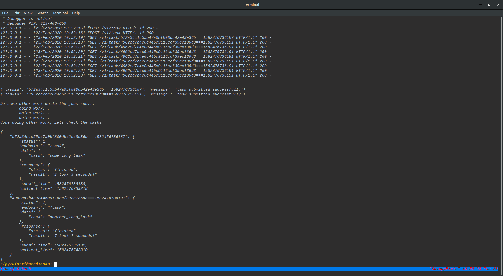

## Flask server to distribute, track, and retrieve the output of long-running tasks on a cluster.

## an example, with the server running on top and the client script being executed on bottom
you can see the client (bottom) send the requests to the server(top), do some other work, and then start
to check/wait on the tasks. Kind of like calling `thread.join()`. The job with id ending in `187` finished
much quicker than the other one. You can tell because the client only had to send one `POST` request for `187`
after doing its own work, meaning it was already done. From there it just had to wait on `191`. 
